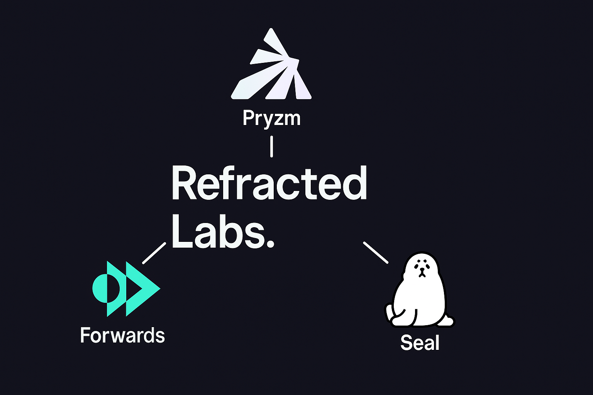

# Refracted Labs

**Refracted Labs** is a research-driven company focused on building foundational infrastructure and applications for the decentralized finance (DeFi) ecosystem. We are the team behind three key projects:

  

---

###  [Pryzm](https://github.com/pryzm-finance)
A modular yield layer enabling efficient yield trading, fixed income, and novel DeFi applications. Pryzm powers a new class of financial primitives and strategies.

---

###  [Forwards](https://github.com/forwards-finance)
FORWARDS is revolutionizing crypto by eliminating one of its most restrictive limitations: the requirement for trades to execute and settle simultaneously. By decoupling trade execution from settlement, FORWARDS unlocks transformative possibilities that redefine capital efficiency, liquidity, and security across DeFi.

---

###  [Seal](https://github.com/seal-protocol)
SEAL Protocol introduces a new orderbook model that allows anyone to place or fill limit orders for any asset pair. By leveraging global liquidity and removing the need for large, pre-funded balances, SEAL simplifies and democratizes on-chain trading.

---

### Connect with Us

- [Twitter](https://x.com/Refracted_Labs)
- [Discord](https://discord.gg/gpWeG57F43)
- [Telegram](https://t.me/pryzm_zone)

---

